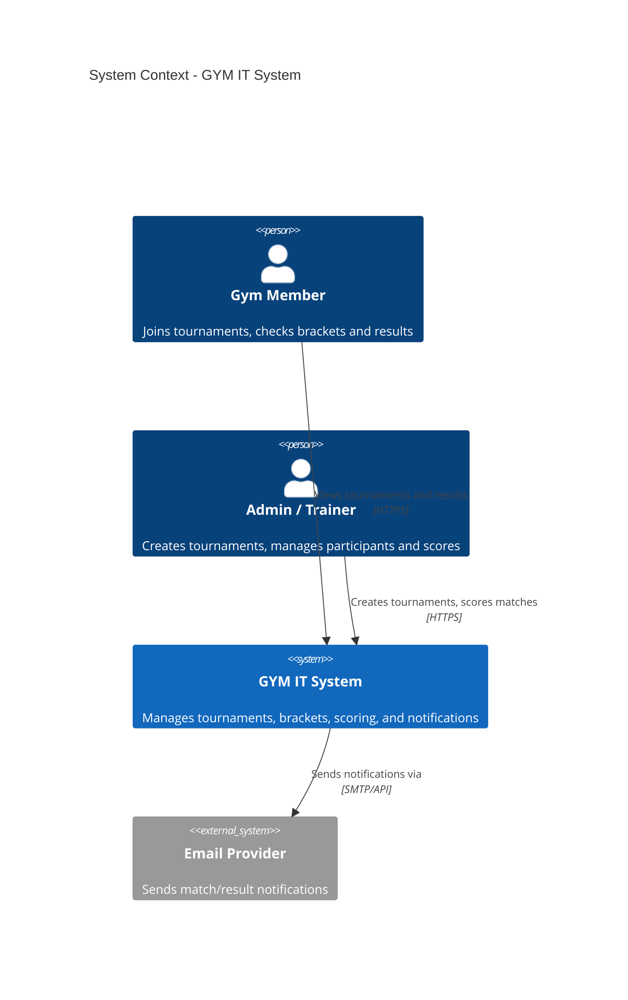
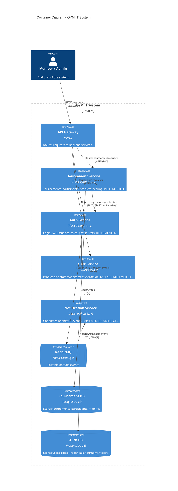
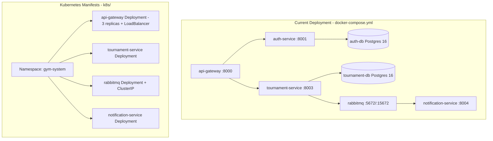

# Architecture Diagrams (C4 Model)

This document describes the GYM IT System architecture at two C4 levels: **System Context** and **Container**.

> Current implementation includes the API Gateway, Auth Service, Tournament
> Service, Notification Service skeleton, and RabbitMQ event broker. A separate
> User Service remains a future extraction from auth/profile concerns.

---

## Level 1: System Context

---

## Level 2: Container Diagram

---

## Deployment View

**Notes:**
- `api-gateway.yaml` defines a scalable Deployment (3 replicas) for the API Gateway.
- Replica count (3) was chosen as a representative scalable configuration rather than a literal "5x" multiplier.
