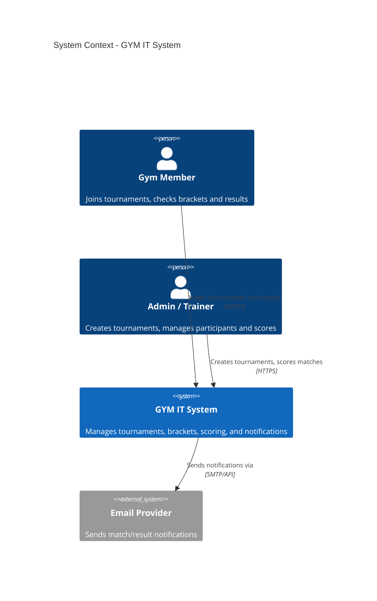
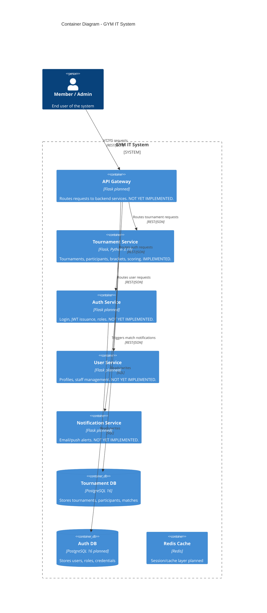
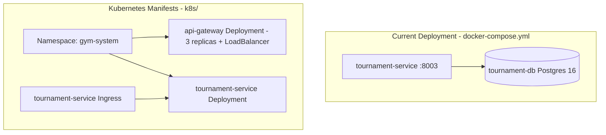

# Architecture Diagrams (C4 Model)

This document describes the GYM IT System architecture at two C4 levels: **System Context** and **Container**.

> Note: only the **Tournament Service** is implemented today. The API Gateway, Auth Service, User Service, and Notification Service are part of the target architecture but are not yet built.

---

## Level 1: System Context

---

## Level 2: Container Diagram

---

## Deployment View

**Notes:**
- `api-gateway.yaml` defines a scalable Deployment (3 replicas) for the API Gateway, ready for when that service is implemented. The Dockerfile in the repo root currently builds the Tournament Service image, since the Gateway code does not exist yet.
- Replica count (3) was chosen as a representative scalable configuration rather than a literal "5x" multiplier.
