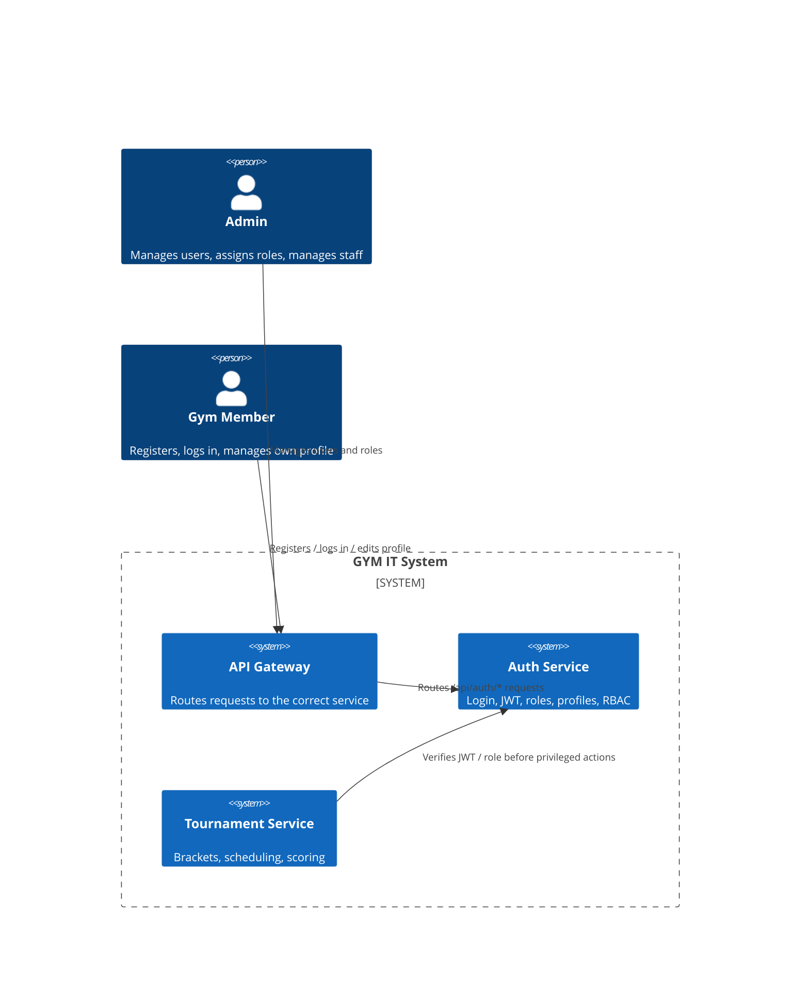
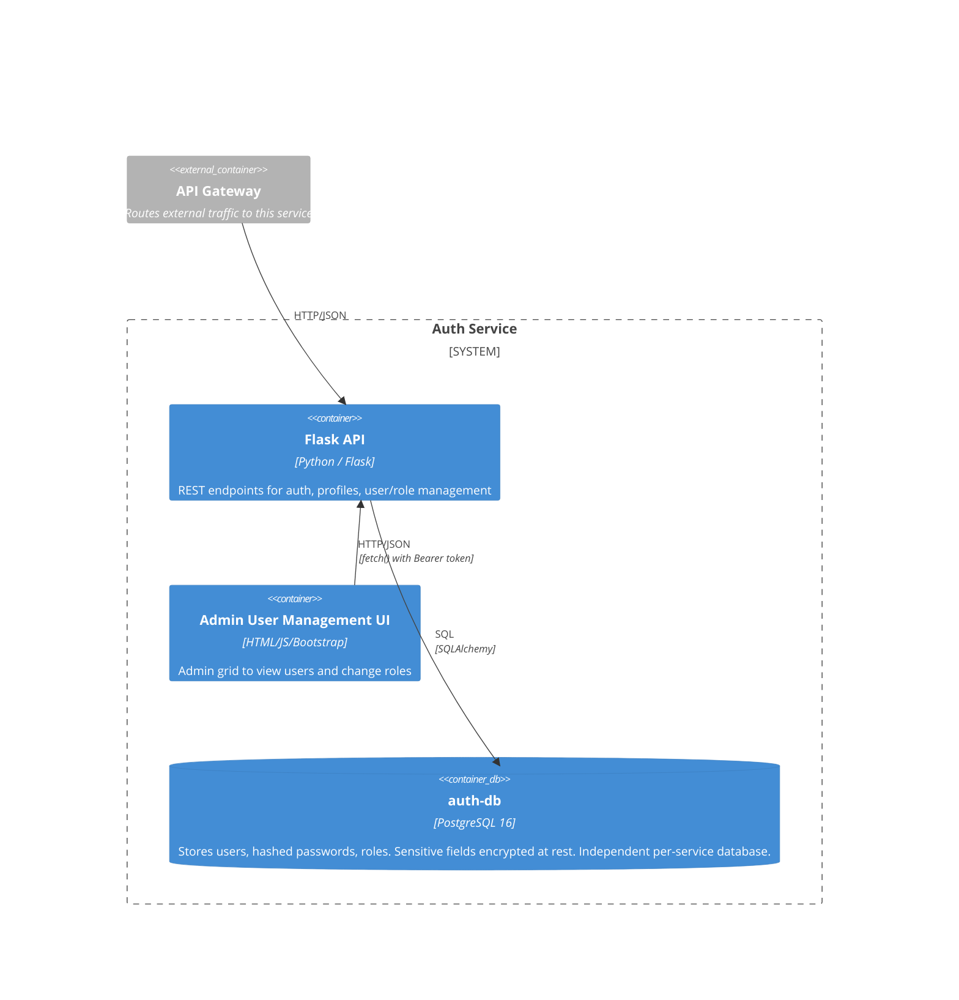
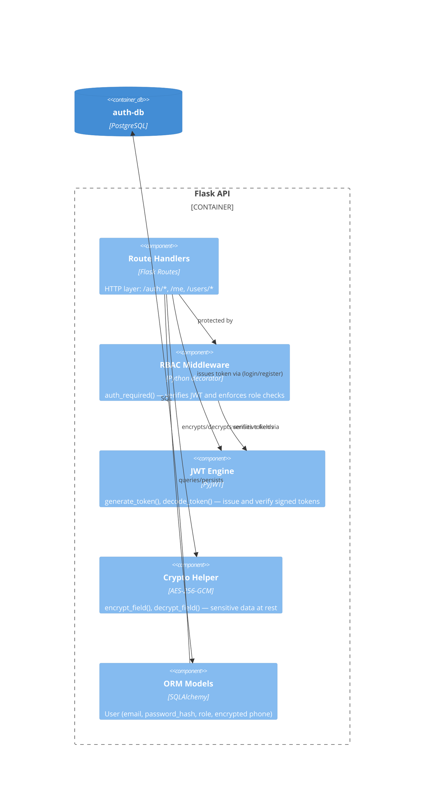

# Auth Service — Architecture Documentation

Architectural responsibility: **Security** (Yazan)
Core domain: **User Management** — authentication, profiles, roles, staff management.

This document follows the C4 model (Context → Container → Component) to
describe how `auth-service` fits into the GYM IT System and how it is built
internally.

---

## Level 1 — System Context

Who uses the system, and how does this service fit into the wider GYM IT
System?

The auth-service is the **trust anchor** of the system: every other service
relies on the JWTs it issues to know *who* is calling and *what role* they
have.

---

## Level 2 — Container Diagram

What are the deployable units that make up the Auth Service, and how do they
communicate?

**Why a separate database per service?** Each microservice in this system
owns its data exclusively (database-per-service pattern). Keeping the user
table inside `auth-service`'s own database means credentials live in exactly
one place, with one team responsible for protecting them — which directly
supports the **Security** quality attribute this role owns.

---

## Level 3 — Component Diagram (inside the Flask API container)

The RBAC middleware (`auth_required`) is deliberately a standalone decorator
decoupled from any single endpoint, so the same role-enforcement logic wraps
every protected route consistently and can be unit tested in isolation (see
`tests/test_app.py`).

---

## Quality Attribute: Security

This is the primary quality attribute owned by this role. It is addressed at
several layers:

| Mechanism | Detail |
|---|---|
| Password storage | Passwords are never stored in plaintext — salted hashes via `werkzeug.security` (`generate_password_hash` / `check_password_hash`) |
| Authentication | Stateless JWT (HS256), signed with a secret injected via environment/k8s Secret. Tokens carry `sub`, `role`, and an expiry (`exp`) |
| Authorization (RBAC) | `auth_required("admin", ...)` decorator enforces role checks on every protected endpoint; members cannot reach admin routes (returns 403) |
| Encryption at rest | Sensitive profile fields (e.g. phone) encrypted with **AES-256-GCM** before being written to the database; GCM also gives tamper detection |
| Encryption in transit | HTTPS enforced at the ingress (`ssl-redirect: "true"`); traffic between gateway and service stays inside the cluster network |
| User-enumeration resistance | Login returns the same generic error for "unknown email" and "wrong password", so attackers can't probe which emails are registered |
| Least privilege | Users cannot change their own role via `/me`; role changes are admin-only (`/users/{id}/role`) |
| Secret management | JWT secret and encryption key are read from env/k8s Secrets and never committed; insecure dev fallbacks are clearly labelled |

## Quality Attribute: Fault Tolerance (operational angle)

| Mechanism | Detail |
|---|---|
| DB connection retry | App retries connecting to Postgres on startup (handles the common race where the app container starts before the database is ready) |
| Gunicorn `--preload` | App/database initialization runs once before forking workers, avoiding startup races between workers |
| Docker healthcheck | Container-level healthcheck independent of Kubernetes, useful for local `docker compose` runs |
| Fail-closed decryption | If the encryption key is wrong or data is corrupt, `get_phone()` returns `None` rather than crashing the request |

---

## API Reference

Full OpenAPI 3.0 specification: [`openapi.yaml`](./openapi.yaml)

Quick summary of endpoints:

| Method | Path | Auth | Purpose |
|---|---|---|---|
| GET | `/healthz` | — | Health check |
| POST | `/auth/register` | — | Register a new user, returns a JWT |
| POST | `/auth/login` | — | Log in, returns a JWT |
| GET | `/auth/verify` | any | Verify a token and return caller identity/role |
| GET | `/me` | any | Get own profile (decrypts phone) |
| PATCH | `/me` | any | Update own profile |
| GET | `/users` | admin | List all users |
| GET | `/users/{id}` | admin | Get one user |
| PATCH | `/users/{id}/role` | admin | Change a user's role |
| PATCH | `/users/{id}/status` | admin | Activate/deactivate an account |
