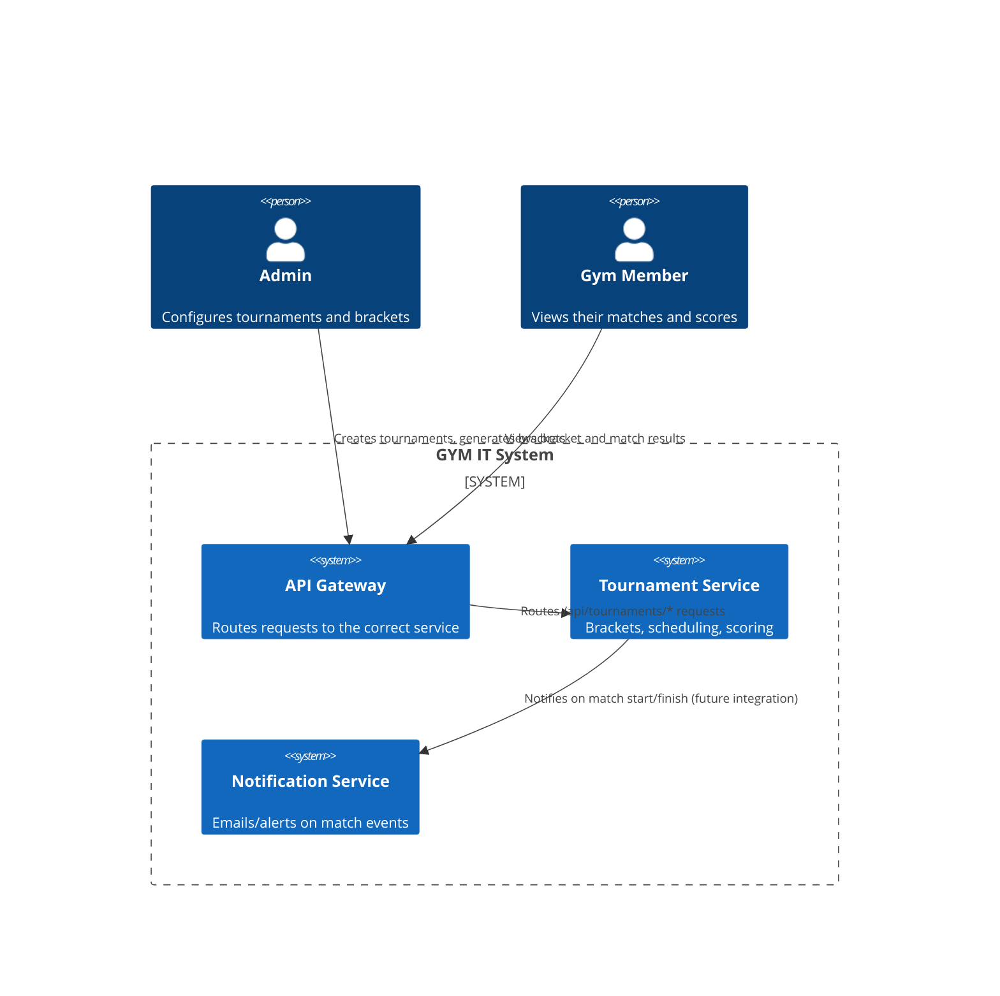
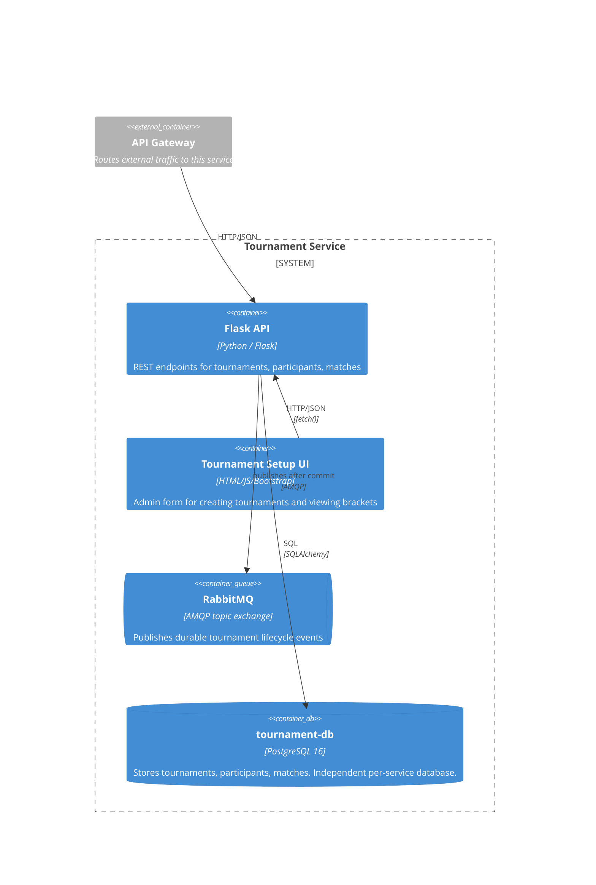
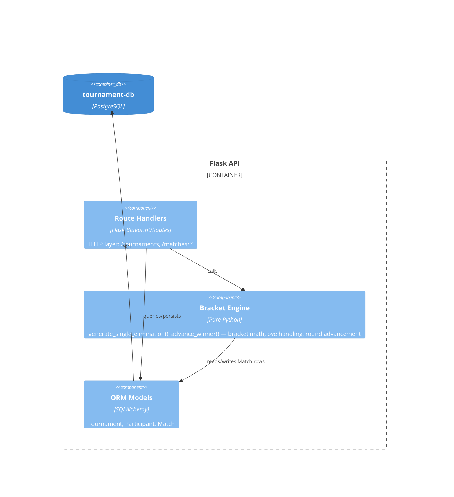

# Tournament Service — Architecture Documentation

Architectural responsibility: **Scalability & DevOps** (Mirgali)
Core domain: **Tournament Engine** — brackets, match scheduling, scoring.

This document follows the C4 model (Context → Container → Component) to
describe how `tournament-service` fits into the GYM IT System and how it
is built internally.

---

## Level 1 — System Context

Who uses the system, and how does this service fit into the wider GYM IT
System?

---

## Level 2 — Container Diagram

What are the deployable units that make up the Tournament Service, and how
do they communicate?

**Why a separate database per service?** Each microservice in this system
owns its data exclusively (database-per-service pattern). This means
`tournament-service` can be scaled, redeployed, or have its schema changed
independently of `auth-service`, `user-service`, etc., without coordinating
migrations across teams — a core requirement for the "Scalability" quality
attribute this role is responsible for.

---

## Level 3 — Component Diagram (inside the Flask API container)

The bracket engine is deliberately kept as plain functions decoupled from
Flask request handling, so the bracket-generation logic (`generate_single_elimination`)
can be unit tested without spinning up a server or database (see
`tests/test_app.py`).

---

## Quality Attribute: Scalability

Addressed via Kubernetes (see `k8s/tournament-service.yaml` and
`k8s/tournament-service-ingress.yaml`):

| Mechanism | Detail |
|---|---|
| Horizontal scaling | `Deployment` starts with 3 replicas; `HorizontalPodAutoscaler` scales 2–10 replicas based on 70% CPU utilization |
| Health checks | `/healthz` used for both `readinessProbe` (don't route traffic until ready) and `livenessProbe` (restart if unresponsive) |
| Resource limits | CPU/memory requests & limits set per pod, preventing one noisy pod from starving others |
| Stateless service | The Flask API itself holds no in-memory state — all state lives in Postgres — so any replica can serve any request, enabling safe horizontal scaling |
| External access | `Ingress` routes `/api/tournaments/*` to the service, consistent with how the API Gateway exposes other services |
| Async fan-out | RabbitMQ carries tournament events to notification/profile projections without coupling them to the scoring request |

## Quality Attribute: Fault Tolerance (DevOps angle)

| Mechanism | Detail |
|---|---|
| DB connection retry | App retries connecting to Postgres on startup (handles the common race condition where the app container starts before the database is ready) |
| Gunicorn `--preload` | App/database initialization runs once before forking worker processes, avoiding race conditions between workers during startup |
| Docker healthcheck | Container-level healthcheck independent of Kubernetes, useful for local `docker compose` runs |
| Broker isolation | RabbitMQ publishing is best-effort with retry/logging; tournament writes do not fail only because async notifications are temporarily down |

---

## API Reference

Full OpenAPI 3.0 specification: [`openapi.yaml`](./openapi.yaml)

Quick summary of endpoints:

| Method | Path | Purpose |
|---|---|---|
| GET | `/healthz` | Health check |
| POST | `/tournaments` | Create a tournament (name, sport, start/end date) |
| GET | `/tournaments` | List tournaments |
| GET | `/tournaments/{id}` | Get one tournament |
| POST | `/tournaments/{id}/participants` | Add a participant |
| GET | `/tournaments/{id}/participants` | List participants |
| POST | `/tournaments/{id}/generate-bracket` | Generate single-elimination bracket |
| GET | `/tournaments/{id}/bracket` | Get current bracket |
| POST | `/matches/{id}/schedule` | Set scheduled date/time for a match |
| POST | `/matches/{id}/score` | Submit a score; winner auto-advances |
